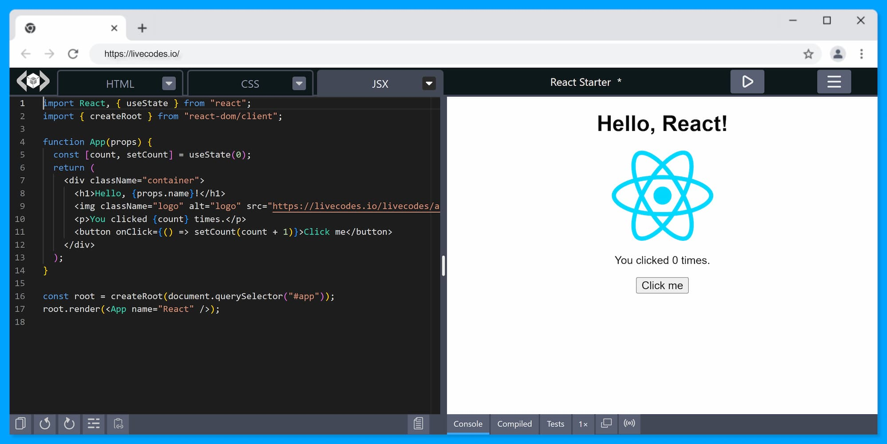
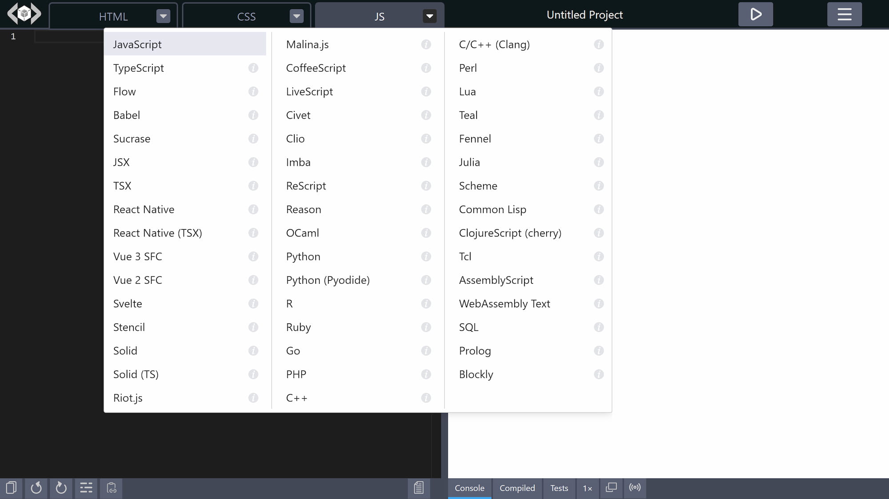
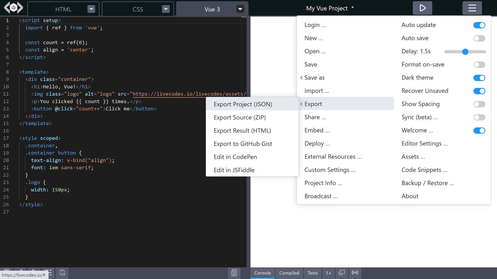
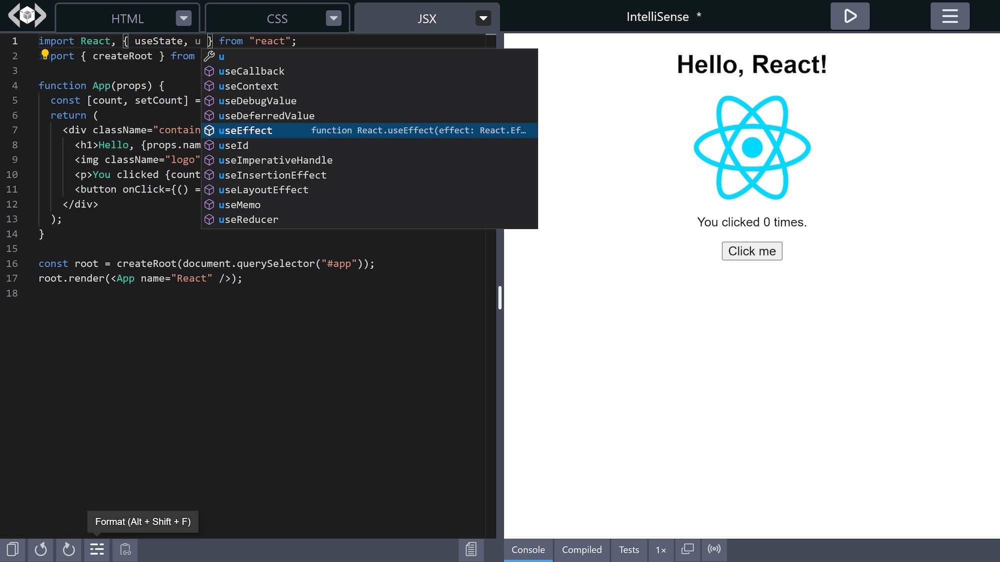
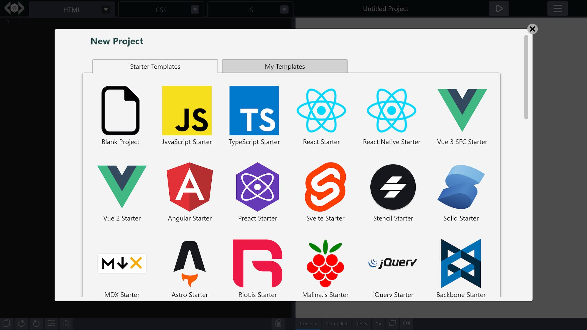

import LiveCodes from '../../src/components/LiveCodes.tsx';

[LiveCodes](https://livecodes.io) is here! 🎊

A Code Playground That Just Works!

I'm thrilled to announce the public release of LiveCodes, a [feature-rich](#what-are-the-main-features), [open-source](#free-and-open-source), [client-side](#client-side), code playground that supports [80+ languages and frameworks](#language-support). With LiveCodes, learning, prototyping, experimenting, documenting, teaching, and sharing code is easier and more enjoyable than ever.

<!--truncate-->



<div class="caption">LiveCodes playground in action</div>

## Outline

- [Why another playground?](#why-another-playground)
- [Show me a demo](#show-me-a-demo)
- [What are the main features?](#what-are-the-main-features)
- [How do I get started?](#how-do-i-get-started)
- [Can I self-host it?](#can-i-self-host-it)
- [What about commercial use?](#what-about-commercial-use)
- [Can I use LiveCodes today?](#can-i-use-livecodes-today)
- [Can I contribute?](#can-i-contribute)
- [Let's start coding!](#lets-start-coding)
- [Where can I learn more?](#where-can-i-learn-more)

<hr />

## Why another playground?

With already existing excellent playgrounds, LiveCodes tries to be different. The major differences include:

### Language Support

Currently, there are 80+ languages/frameworks supported. These include:

- Web languages (HTML, CSS & JavaScript)
- Web frameworks/libraries (e.g. React JSX/TSX, Vue SFC, Svelte SFC, Solid, MDX, Astro).
- Languages that transpile to JavaScript (e.g. TypeScript, CoffeeScript, LiveScript, ReScript).
- Languages/frameworks that generate CSS (e.g. SCSS, Less, Stylus, Tailwind CSS, UnoCSS).
- CSS processors (e.g. PostCSS, Autoprefixer, Lightning CSS, CSS Modules, cssnano).
- Traditional programming languages (e.g. Python, Ruby, Go, PHP, C++, R, Lua, Scheme, Perl).
- Data manipulation/logic languages (e.g. SQL, Prolog).
- Authoring/templating languages (e.g Markdown, AsciiDoc, Pug, Handlebars, Haml).
- Low-code/visual editors (e.g. blockly, rich text editor).
- Modeling languages/diagram-as-code (e.g. Gnuplot, Graphviz, Mermaid, Vega, Plotly).
- Languages that target WebAssembly (e.g. AssemblyScript, WebAssembly Text Format).
- ... and [many more](https://livecodes.io/docs/languages).

Generally, if you are a developer (or want to be one), there is a big chance you will find something interesting to do with LiveCodes.



<div class="caption">A wide range of language support</div>

### Client-Side!

All processing and code transformations run in the browser on the client-side. After the initial load, the app gets significantly faster without having to wait for server rounds. Lazy-loading is heavily used. Only parts of the app required for the selected languages/features are downloaded.

The code you write in LiveCodes does not leave your computer. All projects are private unless you choose to share/export/deploy them.

### Developer Tool

An important goal for LiveCodes is to allow library developers to use it for the documentation of their libraries and showcase their products. This can be achieved by [embedding playgrounds](https://livecodes.io/docs/features/embeds) in blogs, documentation and educational websites. In addition, private (unpublished) modules [can be imported](https://livecodes.io/docs/features/module-resolution#custom-module-resolution) with editor auto-completion and [intellisense](https://livecodes.io/docs/features/intellisense#custom-types).

LiveCodes does NOT aim to be a social coding platform. It will stay as a backendless developer tool. Other platforms are already doing a great job in this regard.

### Build-Free Development Environment

LiveCodes provides many of the tools you may already be using. These include Monaco editor (that powers [VS Code](https://code.visualstudio.com/)), [Prettier](https://prettier.io/), [Emmet](https://emmet.io/), [Babel](https://babeljs.io/), [TypeScript](https://www.typescriptlang.org/), [SCSS](https://sass-lang.com/), [Less](https://lesscss.org/), [PostCSS](https://postcss.org/), [Jest](https://jestjs.io/) and [Testing Library](https://testing-library.com/), among others. [NPM modules](https://livecodes.io/docs/features/module-resolution) can be imported as usual. All these tools run seamlessly in the browser without any explicit build step. It feels like a very light-weight version of your own local development environment with the keyboard shortcuts, IntelliSense and code navigation features.

It just works™ without having to `npm install` anything. Not even on the server (because there is no server!).

:::tip Fun Fact

Significant portions of LiveCodes features were experimented/prototyped inside LiveCodes!

:::

### Web Platform

The output of code written in LiveCodes is a [web page](https://livecodes.io/docs/features/result). Whatever language/syntax you use, the result can ultimately be viewed as a web page which you can interact with, [test](https://livecodes.io/docs/features/tests), [share](https://livecodes.io/docs/features/share) or [deploy](https://livecodes.io/docs/features/deploy). Check the [starter templates](https://livecodes.io?screen=new) for examples.

### Powerful SDK

The LiveCodes playground can be [embedded](https://livecodes.io/docs/features/embeds) in any web page. A powerful [SDK](https://livecodes.io/docs/sdk/) allows the embedding page to interact with the playground (e.g. run, get/set source code, format, get result page or compiled code, get share URL, listen to changes, run tests, get test results, change layout, etc.). This enables other apps to be built on top of LiveCodes.

Check how you can [build an interactive coding tutorial with LiveCodes](../2023-08-04-lets-make-an-interactive-coding-tutorial/index.md)!

Your imagination is the limit!

### Free and Open-Source

LiveCodes is free, with no limits for use, no ads and no account required.
Do you want to [self-host](https://livecodes.io/docs/features/self-hosting) it for commercial use? No problem! It is [MIT-licensed](https://livecodes.io/docs/license) 🎉

<hr />

## Show me a demo

This is a demo for an [embedded playground](https://livecodes.io/docs/features/embeds). Try editing the code!

<LiveCodes template="react" loading="eager" height="80vh" />

<div class="caption playground-caption">This is an interactive demo. Try editing the code!</div>

Or, go to [livecodes.io](https://livecodes.io) to try the full standalone playground.

<hr />

## What are the main features?



<div class="caption">A large set of features!</div>

### Powerful Editor

The default code editor is the powerful editor that powers [VS Code](https://code.visualstudio.com/), featuring code-completion, go-to-definition, multi-cursor support and other powerful features you got used to. The editor is very [customizable](https://livecodes.io/docs/features/editor-settings). It supports keyboard shortcuts, [code formatting](https://livecodes.io/docs/features/code-format), [Emmet abbreviations](https://livecodes.io/docs/features/editor-settings#emmet) and even [Vim and Emacs bindings](https://livecodes.io/docs/features/editor-settings#editor-modes).



<div class="caption">A powerful editor with IntelliSense</div>

### Mobile-friendly

The responsive layout allows working on devices with different screen sizes. On mobile, a lighter-weight touch-friendly code editor (CodeMirror 6) is used, so that you can experiment your ideas on the go.

### External Code/Libraries

[External scripts/stylesheets](https://livecodes.io/docs/features/external-resources) can be added to the web page. There is a UI screen that helps you search for and add NPM libraries and google fonts. Moreover, [NPM modules can be imported](https://livecodes.io/docs/features/module-resolution) without the need for any `npm install`s.

### Import and Code Pre-fill

Code can be [imported](https://livecodes.io/docs/features/import) from a variety of sources including GitHub gist, GitHub file, directory in a GitHub repo, Gitlab snippet, Gitlab file, directory in a Gitlab repo, JS Bin, raw code, code in web page DOM and code in zip file. You can also [pre-fill code](https://livecodes.io/docs/features/code-prefill) using various ways.

### Share/Export

Projects can be easily [shared](https://livecodes.io/docs/features/share) as URLs or QR codes. In addition, you may export any project as HTML, JSON or zip file containing source code files. You may also [export](https://livecodes.io/docs/features/export) to other services like GitHub gists, CodePen or JSFiddle.

### Embedded Playgrounds

Projects can be [embedded](https://livecodes.io/docs/features/embeds) in any web page. The embed screen allows you to customize the embed options and preview the resulting playground. An easy-to-use, yet powerful, [SDK](https://livecodes.io/docs/sdk/), allows [communication](https://livecodes.io/docs/sdk/js-ts#sdk-methods) between the embedding page and the playground. In addition, code can be easily [prefilled](https://livecodes.io/docs/features/code-prefill). Check the [demo](#show-me-a-demo).

This is particularly useful for educational websites and for library documentations. It is secure and highly [configurable](https://livecodes.io/docs/configuration/). Custom modules can be [imported](https://livecodes.io/docs/features/module-resolution#custom-module-resolution) with full [Intellisense](https://livecodes.io/docs/features/intellisense)!

### Lite mode

In [lite mode](https://livecodes.io/docs/features/lite), a light-weight, minimal code editor is used. This is specifically useful if you expect your users to make very little code edits, specially if you want to embed multiple playgrounds in the same webpage.

[Code formatting](https://livecodes.io/docs/features/intellisense/code-format), [Emmet abbreviations](https://livecodes.io/docs/features/intellisense/emmet) and [dev tools](https://livecodes.io/docs/features/intellisense/tools-pane) are not available. However, any language supported by LiveCodes can be used, with syntax highlighting. Code edits are compiled and shown in the [result page](https://livecodes.io/docs/features/intellisense/result) as usual.

### Deploy

Projects can be [deployed](https://livecodes.io/docs/features/deploy) to public URLs that can be shared with others. This is hosted for free on GitHub Pages.

### Starter Templates

A large number of [starter templates](https://livecodes.io/docs/features/templates) are available. They can be used to get you started with most of the supported technologies.



<div class="caption">Starter templates</div>

### Assets

Your own local assets (e.g. images, icons, fonts, local scripts and stylesheets) can be added to the app and then used in any project. The assets are made available even when the projects are shared, exported or deployed.

### Dev Tools

[Tools](https://livecodes.io/docs/features/tools-pane) like [console](https://livecodes.io/docs/features/console), [compiled code viewer](https://livecodes.io/docs/features/compiled-code) and [test runner](https://livecodes.io/docs/features/tests) can significantly improve your development experience.

### Broadcast

You can [broadcast](https://livecodes.io/docs/features/broadcast) source code or [result page](https://livecodes.io/docs/features/result) in real-time to others. This can be of great value as an educational tool and for demo purposes.

### Sync/Backup/Restore

Do you work on multiple devices? No Problem! You may [sync](https://livecodes.io/docs/features/sync) or [backup and restore](https://livecodes.io/docs/features/backup-restore) your data any time on any device.

### Developer-friendly

LiveCodes makes it easy to [get started](https://livecodes.io/docs/getting-started). It is highly [configurable](https://livecodes.io/docs/configuration/). Lots of features can be configured by URL [query params](https://livecodes.io/docs/configuration/query-params). The [SDK](https://livecodes.io/docs/sdk/) facilitates [embedding](https://livecodes.io/docs/features/embeds) playgrounds and allows easy [communication](https://livecodes.io/docs/sdk/js-ts#sdk-methods) with them. The SDK is available for use in [Vanilla JS/TS](https://livecodes.io/docs/sdk/js-ts), [React](https://livecodes.io/docs/sdk/react), [Vue](https://livecodes.io/docs/sdk/vue) and [Svelte](https://livecodes.io/docs/sdk/svelte).

### Focused on Privacy

Projects are private by default. The code you write in LiveCodes never leaves your computer, unless you choose to [share](https://livecodes.io/docs/features/share), [export](https://livecodes.io/docs/features/export), [broadcast](https://livecodes.io/docs/features/broadcast) or [sync](https://livecodes.io/docs/features/sync) it. User data is stored in the browser.

### Documentation

Comprehensive documentations are available for [features](https://livecodes.io/docs/features/), [configuration](https://livecodes.io/docs/configuration/), [supported languages](https://livecodes.io/docs/languages/) and [SDK](https://livecodes.io/docs/sdk/) (including [TypeScript Types](https://livecodes.io/docs/api/modules)). Documentations are rich with code samples, live demos and screenshots. A gallery of usage examples is provided as a [storybook](https://livecodes.io/stories). You can even just ask our [AI chatbot](https://livecodes.io/docs).

### More Features

Go to the [features](https://livecodes.io/docs/features/) documentation to know about more features with detailed description.

<hr />

## How do I get started?

Check the [getting started guide](https://livecodes.io/docs/getting-started). However, in a nutshell:

- To use the standalone App:

  Just go to [livecodes.io](https://livecodes.io) and enjoy all the [features](https://livecodes.io/docs/features)!

- To embed a playground in your web page:

  Add this code to your web page:

  ```html
  <div id="container"></div>

  <script type="module">
    import { createPlayground } from 'https://unpkg.com/livecodes';

    createPlayground('#container', {
      params: {
        markdown: '# Hello LiveCodes!',
        css: 'h1 {color: dodgerblue;}',
        js: 'console.log("Hello, from JS!");',
        console: 'open',
      },
    });
  </script>
  ```

  Please check the documentation about [embedded playgrounds](https://livecodes.io/docs/features/embeds) and [SDK](https://livecodes.io/docs/sdk/) for more details.

<hr />

## Can I self-host it?

Sure!

- Download a [release](https://github.com/live-codes/livecodes/releases).
- Put it on a static file server.

... and it just works!

Please check the documentation about [self-hosting](https://livecodes.io/docs/features/self-hosting) for more details.

<hr />

## What about commercial use?

Feel free to use it for commercial purposes. It is [MIT-licensed](https://livecodes.io/docs/license) 🎉

If you find it useful, please consider [supporting the project](https://livecodes.io/docs/sponsor) 💚.

<hr />

## Can I use LiveCodes today?

Yes!

However, please note that LiveCodes is currently in **public beta**. It is in active development.

Having said that, the public-facing API has been stable for a while. [Permanent URLs](https://livecodes.io/docs/features/permanent-url) are available for the app and SDK to avoid later breaking changes in your embedded playgrounds.

<hr />

## Can I contribute?

Of course! You are very welcome. Please [start here](https://livecodes.io/docs/contribution).

<hr />

## Let's start coding!

Visit [livecodes.io](https://livecodes.io) to experience LiveCodes for yourself!

Please [star the repo](https://github.com/live-codes/livecodes), [let us know](https://livecodes.io/docs/contact) what you think and [report any bugs](https://github.com/live-codes/livecodes/issues) you find.

If you do use LiveCodes in a project, we'd [love to hear](https://livecodes.io/docs/contact) about it (we may add a link to it!).

What will you learn/build/teach with LiveCodes today?

<hr />

## Where can I learn more?

- [LiveCodes](https://livecodes.io)
- [Docs](https://livecodes.io/docs)
- [Blog](https://blog.livecodes.io)
- [GitHub](https://github.com/live-codes/livecodes)
- [Twitter](https://twitter.com/livecodes_io)
- [Dev](https://dev.to/livecodes_io)
- [Contact](https://livecodes.io/docs/contact)
