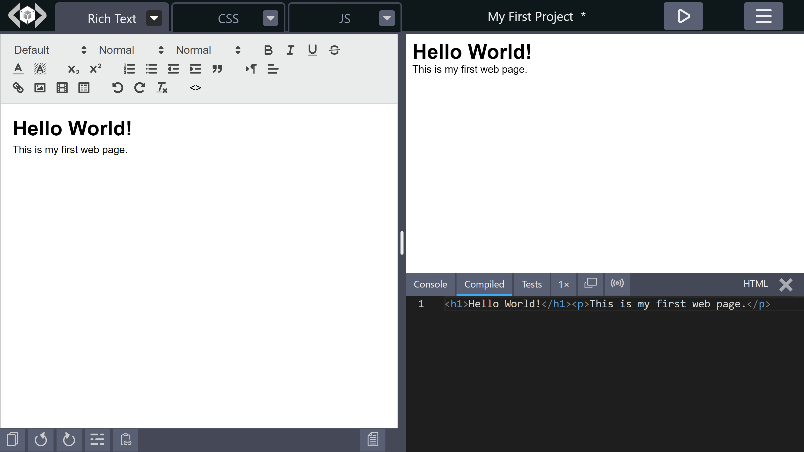
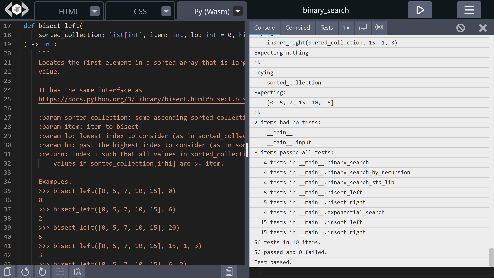

import LiveCodes from '../../src/components/LiveCodes.tsx';

## LiveCodes - A Gateway to Interactive Learning

In the evolving landscape of education, teachers and students are continuously seeking effective learning tools. The need for such tools is even more pronounced in the sphere of programming. The complexity of setting up development environments and the steep learning curve of programming languages are often challenging. This is where [LiveCodes](https://livecodes.io) steps in, offering a seamless solution that makes programming accessible, interactive, and engaging while remaining free (and open-source) with unlimited usage. The versatility of LiveCodes makes it an ideal tool for schools, colleges, and coding bootcamps, as well as course websites and online learning platforms.

<!-- truncate -->

## What is LiveCodes?

[LiveCodes](https://livecodes.io) is a [feature-rich](https://livecodes.io/docs/features), [open-source](https://github.com/live-codes/livecodes), [client-side](https://livecodes.io/docs/why#client-side), code playground that runs directly in your browser. It is an innovative platform that enables quick prototyping and experimenting with various technologies without the need for setup of individual development environments. It is an excellent tool for learning and teaching programming, offering a platform for quick prototyping and idea experimentation.

See more: <a href="../introducing-livecodes/">Introducing LiveCodes 🎉</a>, <a href="https://livecodes.io/docs/">LiveCodes Docs</a>

## Language Support

LiveCodes supports a wide range of programming languages (currently <a href="https://livecodes.io/docs/languages/">more than 80</a>), making it suitable for teaching and learning different programming concepts. Here are some of the language categories supported by LiveCodes:

### Web Languages

LiveCodes supports web languages, including HTML, CSS, and JavaScript. It also extends support to web frameworks like React, Vue, Svelte, and Solid. In addition, the most popular CSS processors and frameworks are supported, including Sass, Less, Stylus, Tailwind CSS, CSS modules, PostCSS, and many more.

Demo:

<LiveCodes template="react" height="70vh" />

Embedded (interactive) playground for React starter template

### Python

Python, one of the most popular languages for beginners and experienced coders alike, is also supported on LiveCodes. This allows for a broader range of applications and projects to be developed and tested on the platform. Data science and machine learning projects are also supported ([using Pyodide](https://livecodes.io/docs/languages/python-wasm)).

Demo:

<LiveCodes template="python" height="70vh" />

Embedded (interactive) playground for Python starter template

See more: <a href="https://livecodes.io/docs/languages/python">Python Docs</a>, <a href="https://livecodes.io/?template=python">Python starter template</a>, <a href="https://livecodes.io/docs/languages/python-wasm">Python-Wasm Docs</a>, <a href="https://livecodes.io/?template=python-wasm">Python-Wasm starter template</a>

### Block-Based and Low-Code Programming

For beginners, particularly kids, LiveCodes offers Blockly, a block-based programming interface. This feature makes learning programming concepts easier and more engaging, providing a strong foundation for future coding education. More over, LiveCodes also supports a rich text editor which produces valid HTML. The readable code produced by these tools (JavaScript from Blockly and HTML from the rich text editor) can be examined by the user for an engaging learning experience.

A screenshot for Blockly starter template on LiveCodes

Rich text editor on LiveCodes

See more: <a href="https://livecodes.io?template=blockly">Blockly starter template</a>, <a href="https://livecodes.io/?richtext=%3Ch1%3EHello%20World!%3C/h1%3E%3Cp%3EThis%20is%20my%20first%20web%20page.%3C/p%3E&compiled=open">rich text editor example</a>

### More Languages

LiveCodes supports a comprehensive list of other languages, including C, C++, PHP, Ruby, Go, Lua, Scheme, Common Lisp, R, Julia, and many more. This makes LiveCodes a universal tool for learning and teaching programming. The large number of starter templates makes it easy to get started with any of the supported programming languages.

See more: <a href="https://livecodes.io/docs/languages/">LiveCodes Languages</a>, <a href="https://livecodes.io/?new">Starter Templates</a>

## Powerful Editor

The default code editor is the powerful editor that powers VS Code, featuring intellisense, code-completion, go-to-definition, multi-cursor support and other powerful features. The editor is very customizable. It supports keyboard shortcuts, code formatting, Emmet abbreviations and even Vim and Emacs bindings.

LiveCodes editor intellisense

See more: <a href="https://livecodes.io/docs/features/#powerful-editor">Code Editor</a>

## Importing Code

LiveCodes makes code importing seamless. Code can be easily pulled from GitHub and many other sources without leaving the platform, providing an excellent opportunity for students to learn from existing codes and integrate them into their projects or assignments.

Import screen

See more: <a href="https://livecodes.io/docs/features/import">Import</a>

## Exporting/Sharing Projects

Collaboration is at the heart of LiveCodes. Projects can be exported locally or to GitHub gists. In addition, users can easily share projects with peers or teachers, making it a valuable tool for cooperative learning and project evaluation.

Export project

Share screen

See more: <a href="https://livecodes.io/docs/features/export">Export</a> - <a href="https://livecodes.io/docs/features/share">Share</a>

## Integrated Console

LiveCodes provides an integrated console, enabling users to examine their code output in real time, a feature that significantly enhances the learning and debugging experience.

See more: <a href="https://livecodes.io/docs/features/console">Console</a>

## Compiled Code Viewer

The compiled code viewer in LiveCodes is an excellent tool for students learning new languages and frameworks. It provides a clear view of how languages like TypeScript/JSX compile to JavaScript, or how CSS processors operate.

See more: <a href="https://livecodes.io/docs/features/compiled-code">Compiled Code</a>

## Tasks and Assignments

LiveCodes offers a test runner that can be used to validate tasks and assignments, providing immediate feedback. This feature allows teachers to set tasks and students to validate their solutions, promoting an interactive learning environment.

LiveCodes test runner

Python doctests

See more: <a href="https://livecodes.io/docs/features/tests">Tests</a>

## Rapid Feedback

One of the standout features of LiveCodes is its instant feedback mechanism. Students can see the result of their code directly in the browser without running any compilation or build. This immediate response encourages experimentation and enhances understanding.

## AI Assistance

The AI code assistant available (for free) in LiveCodes helps users write better code. This feature provides on-the-fly suggestions and corrections, making the journey of learning coding less daunting for beginners and more efficient for advanced users. The AI assistance can be turned off for tasks and assignments.

LiveCodes AI code assistant (JavaScript)

LiveCodes AI code assistant (Python)

See more: <a href="https://livecodes.io/docs/features/ai">AI Code Assistant</a>

## Interactive Tutorials

The embedded playgrounds together with the powerful SDK allows you to create engaging interactive tutorials. Such tutorials can guide students through different programming concepts and projects, making LiveCodes a fun educational tool.

A screenshot of LiveCodes interactive tutorial

See more: <a href="../lets-make-an-interactive-coding-tutorial/">Let's Make an Interactive Coding Tutorial</a>

## Mobile-Friendly

LiveCodes is not confined to desktops. The platform is mobile-friendly, allowing users to code on-the-go. The responsive layout allows working on devices with different screen sizes. On mobile, a lighter-weight touch-friendly code editor (CodeMirror 6) is used. This ensures that learning, practicing, or teaching coding can take place anytime, anywhere.

LiveCodes mobile interface

## Embedded Playgrounds

LiveCodes playgrounds can be easily embedded in any web page, be it in a course website, a tutorial blog post or a learning management system (LMS). The embed screen makes it easy to customize various options and configurations, and provides a preview for the embedded playground. Alternatively, the powerful [SDK](https://livecodes.io/docs/sdk) can be used to provide full control over creating and communicating with the embedded playground.

LiveCodes embed screen

## Full Power with the SDK

One of the distinguishing features of LiveCodes is its powerful SDK that provides an easy way for creating and communicating with embedded playgrounds. The SDK is available for various technologies including vanilla JavaScript, TypeScript, React, Vue, and Svelte. This opens up endless possibilities for using it as a building block for bigger platforms that can revolutionize education.

See more: <a href="https://livecodes.io/docs/sdk">LiveCodes SDK</a>

## Free and Open-Source

LiveCodes is totally free to use. There are no ads, no subscriptions, no account required, and no limits to its use. It can also be easily self-hosted and is licensed under the permissive MIT license which allows free commercial use.

See more: <a href="https://github.com/live-codes/livecodes">LiveCodes on GitHub</a>

## Conclusion

LiveCodes is an impactful and revolutionary tool that can transform the way programming is taught and learned in educational environments. Its rich features, wide language support, and ease of use make it a great choice for educators and learners.

## Get in Touch

Are you a teacher who wants to use LiveCodes for teaching? Are you a developer who wants to build an online learning platform? Please [get in touch](https://livecodes.io/docs/contact). We would love to help.

If you have any questions or feature requests, please [submit an issue](https://github.com/live-codes/livecodes/issues) in the GitHub repo.

## Start Now 🚀

- [LiveCodes](https://livecodes.io)
- [Starter Templates](https://livecodes.io?new)
- [Documentations](https://livecodes.io/docs)
- [Star the GitHub Repo](https://github.com/live-codes/livecodes)
- [Follow on Twitter/X](https://twitter.com/livecodes_io)
