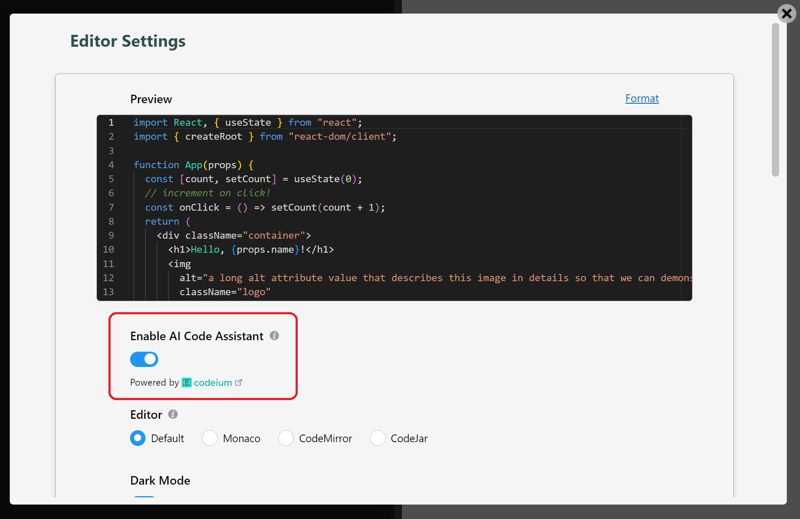

I'm excited to announce the general availability of _LiveCodes AI Code Assistant_. It is totally **free**, for **unlimited usage**, with **no account or API token required** and with **no need to install any browser extensions**. It can be easily enabled from the UI (as easy as [flipping a switch](https://livecodes.io/?screen=editor-settings)!)

<!--truncate-->



The AI code completion is powered by [Codeium](https://codeium.com/), the ultrafast Copilot alternative.

It has a wide range of language support, and it works everywhere (in the [standalone app](https://livecodes.io/docs/getting-started#standalone-app), [embedded playgrounds](https://livecodes.io/docs/features/embeds) and [self-hosted](https://livecodes.io/docs/features/self-hosting) apps).

Currently, only [Monaco editor](https://livecodes.io/docs/features/editor-settings#code-editor) is supported. Wider editor support is planned.

## Examples:

JavaScript:

<video controls style={{width: '100%'}}>

  <source src="https://v23.livecodes.io/docs/vid/LiveCodes-AI.mp4" type="video/mp4" />
</video>

Python:

<video controls style={{width: '100%'}}>

  <source src="https://v23.livecodes.io/docs/vid/LiveCodes-AI-py.mp4" type="video/mp4" />
</video>

## How it works?

The large generative machine learning model is capable of understanding the context of your code and comments (across the [3 code editors](https://livecodes.io/docs/features/projects#markup-editor)) in order to generate suggestions on what you might want to type next.

## How can I use it?

The AI code assistant can be enabled from:

### UI

The [editor settings](https://livecodes.io/?screen=editor-settings) screen (App menu → Editor Settings → Enable AI Code Assistant).

When set from the UI, this configuration is saved locally to user settings and is remembered across sessions.

### Configuration

Alternatively, this can be enabled/disabled (_only for the current session_) using the [`enableAI`](https://livecodes.io/docs/configuration/configuration-object#enableai) property in the [configuration object](https://livecodes.io/docs/configuration/configuration-object). This can be used to enable the AI code assistant in [embedded playgrounds](https://livecodes.io/docs/features/embeds).

Example:

```js
import { createPlayground } from 'livecodes';

createPlayground('#container', {
  config: {
    // highlight-next-line
    enableAI: true,
  },
});
```

Also this can be enabled using [query params](https://livecodes.io/docs/configuration/query-params) (e.g. https://livecodes.io/?enableAI).

## Why isn't it enabled by default?

When using the AI assistant, your code is sent to [Codeium](https://codeium.com/) servers for code completion. LiveCodes has a very [strict philosophy](https://livecodes.io/docs/why#client-side) which mandates that your code never leaves your device unless you choose to.

Please note that even though your code is sent to Codeium, it is not used for training their model. Check Codeium [FAQ](https://codeium.com/faq#Will-Codeium-regurgitate-private-code%3F) and [privacy policy](https://codeium.com/privacy-policy) for more details.

Moreover, in many uses of LiveCodes it may not be desireable to have AI code completions (e.g. courses, quizzes, etc.).

## Let's try it! 🚀

Go to the [editor settings](https://livecodes.io/?screen=editor-settings) screen. Enable the AI code assistant and enjoy the magic! ✨

Please ⭐ [star the project on GitHub](https://github.com/live-codes/livecodes) if you like it, and follow [LiveCodes on Twitter](https://twitter.com/livecode_io) to be notified with latest updates!
