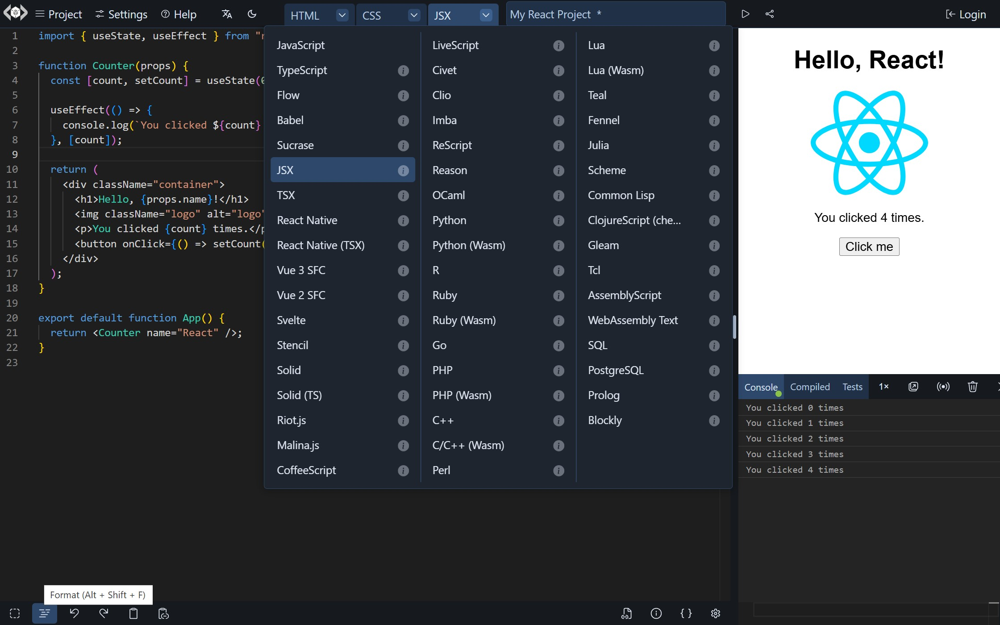
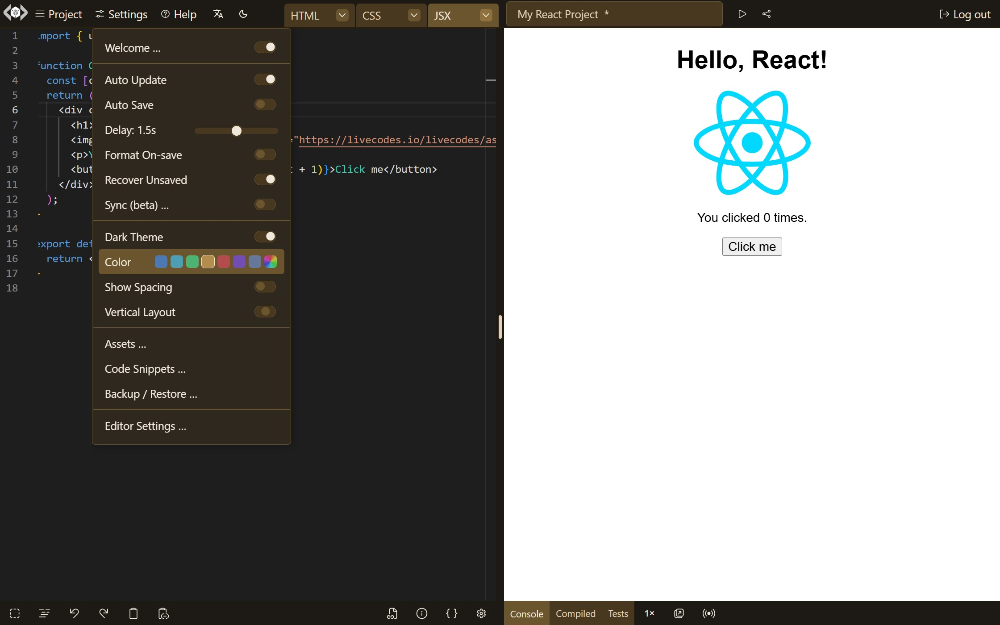
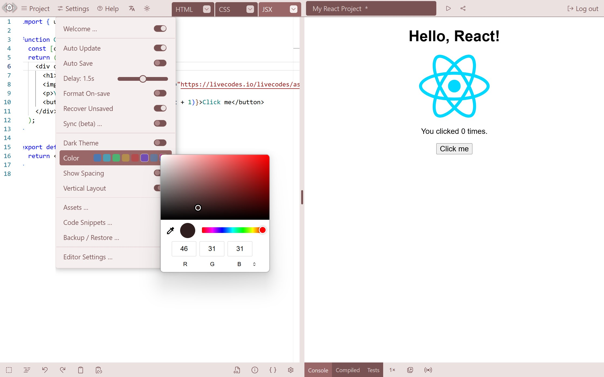
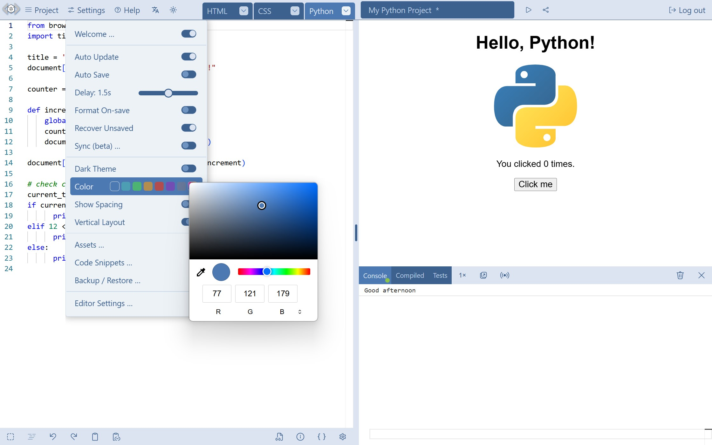
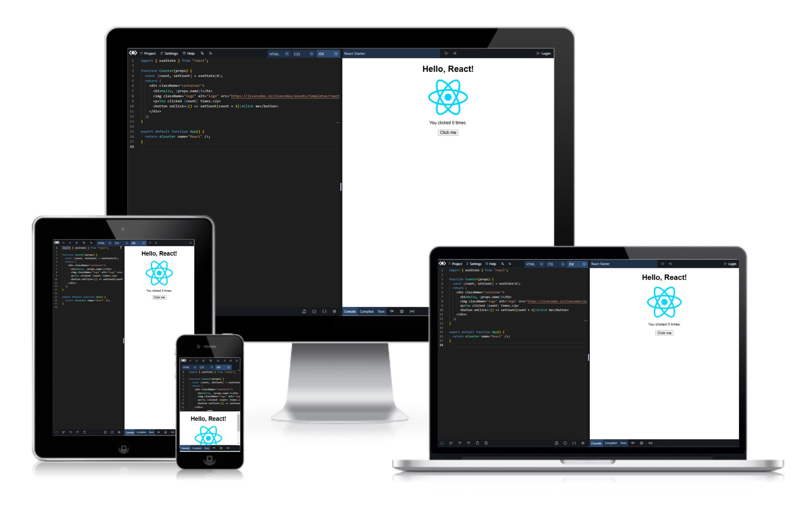
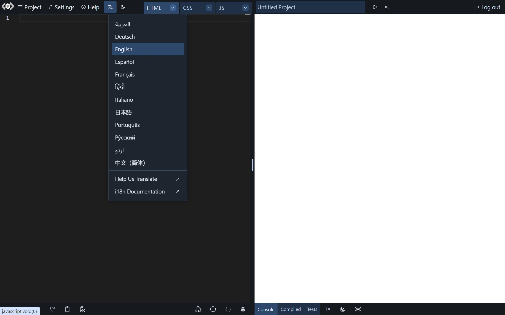
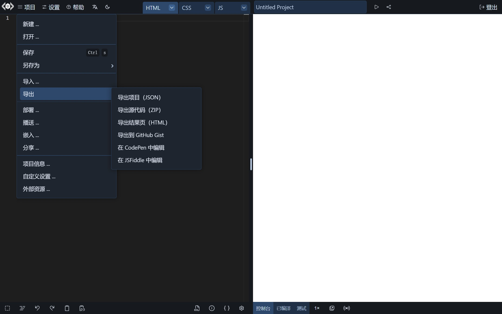

LiveCodes [recent release](https://github.com/live-codes/livecodes/releases/tag/v36) provides a major update to the UI. The new UI is more modern, cleaner, more accessible and allows customization with custom theme colors.

In addition, LiveCodes now supports multiple languages. It already supports 90+ programming languages. But we are adding spoken languages this time! With the new internationalization (i18n) support, the UI now can be displayed in 12 different languages.

<!--truncate-->

## The New UI

The UI is now cleaner, more consistent and more accessible.

In addition, the UI theme is now custommizable with custom colors. The theme color can be selected from the UI (Settings menu -> Color).

The color applies to dark and light themes.

The theme color can also be selected as the configuration option [`themeColor`](https://livecodes.io/docs/configuration/configuration-object#themecolor). This allows setting the color using the [SDK](https://livecodes.io/docs/sdk/) (for [embedded playgrounds](https://livecodes.io/docs/features/embeds)) or [query params](https://livecodes.io/docs/configuration/query-params).

Example: https://livecodes.io/?themeColor=lightblue

The UI is responsive and can be used in different screen sizes.

## Multilingual Support (i18n)

The UI can now be displayed in 12 different languages: English (default), Arabic, Chinese, French, German, Hindi, Italian, Japanese, Portuguese, Russian, Spanish and Urdu.

The language is auto-detected based on the user's browser language. In addition, the language can be selected from the UI (i18n menu).

Moreover, the UI language can also be set using the configuration option [`appLanguage`](https://livecodes.io/docs/configuration/configuration-object#applanguage).

Example: https://livecodes.io/?appLanguage=fr

## Credits

A huge shout-out to the wonderful contributors who helped make this release possible by working for months to provide high quality work. Very special thanks to:

- [**Nuno Luciano**](https://x.com/nunoluciano) (aka [gigamaster](https://github.com/gigamaster)) for the design and implementation of the new UI.
- **Max Alex** (aka [zyf722](https://github.com/zyf722)) for the i18n support.

Contributions are always welcome. Check out the [contribution guide](https://github.com/live-codes/livecodes/blob/develop/CONTRIBUTING.md) for more details.

## What's next?

We have been busy the past few months working on the UI and setting up the infra-structure for more features to come. Now expect more features to be rolling out more frequently.

Stay tuned!

You can stay updated by following us on [X/Twitter](https://x.com/livecodes_io) and [GitHub](https://github.com/live-codes/livecodes).
